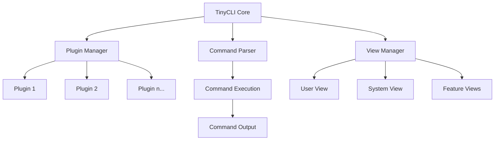

# TinyCLI

TinyCLI is a modern embedded Linux command line framework designed for managing embedded device configurations. It serves as a central entry point for system configuration management on embedded devices.

## Core Design

TinyCLI provides a lightweight, extensible framework where subsystems and components can register through plugins (JSON configuration) to implement their own configuration and display capabilities.

### Architecture



### Key Components

1. **Core Framework**: Minimal implementation that handles command parsing, view management, and plugin loading
2. **Plugin System**: JSON-based plugin registration for extending functionality
3. **View Hierarchy**: Support for user, system, and feature-specific views
4. **Command Helpers**: Auto-completion, help system, and command history

## Features

- **Hierarchical View Structure**: User view, system view, and feature-specific views
- **View Switching**: Easy navigation between different command views
- **Command Help**: Context-sensitive help with `?` support
- **Auto-completion**: Tab completion for commands and parameters
- **Custom Shortcuts**: Redefined system shortcuts (Ctrl+C, Ctrl+Z) for better user experience
- **Standardized Output**: Consistent command output formatting

## Prerequisites

The following libraries are required to build TinyCLI:

- libreadline-dev: Command line editing library
- libjansson-dev: JSON parsing library
- gcc/g++: C compiler
- cmake: Build system

On Debian/Ubuntu systems, you can install these dependencies with:

```bash
sudo apt install build-essential cmake libreadline-dev libjansson-dev
```

## Building

```bash
mkdir build && cd build
cmake ..
make
```

## Extending TinyCLI

### Plugin System Overview

TinyCLI uses a flexible plugin system that allows you to extend its functionality without modifying the core code. Plugins are loaded dynamically at runtime and can add new commands to any view.

### Plugin Directory

By default, TinyCLI looks for plugins in the `plugins` directory relative to the executable. You can override this by setting the `TINYCLI_PLUGIN_PATH` environment variable:

```bash
export TINYCLI_PLUGIN_PATH=/path/to/your/plugins
```

### Plugin Structure

Each plugin consists of two main components:

1. **JSON Configuration File**: Describes the plugin metadata and commands
2. **Shared Library**: Contains the implementation of the plugin's commands

### JSON Configuration

Create a JSON configuration file in the plugins directory:

```json
{
  "name": "network",
  "description": "Network configuration commands",
  "version": "1.0",
  "commands": [
    {
      "name": "interface",
      "view": "config",
      "description": "Configure network interfaces",
      "handler": "network_interface_handler"
    }
  ],
  "library": "libnetwork_plugin.so"
}
```

### Plugin Implementation

Create a C source file implementing your plugin:

```c
#include "tinycli.h"
#include "tinycli_plugin.h"

// Command handler implementation
static int network_interface_handler(tinycli_cmd_ctx_t *ctx) {
    // Your implementation here
    return 0;
}

// Define plugin commands
static tinycli_cmd_t commands[] = {
    {
        .name = "interface",
        .description = "Configure network interfaces",
        .view = VIEW_CONFIG,
        .handler = network_interface_handler,
        .params = NULL,
        .num_params = 0,
        .changes_view = false,
        .target_view = VIEW_CONFIG
    }
};

// Plugin initialization
static int plugin_init(void *user_data) {
    return 0;
}

// Plugin cleanup
static int plugin_cleanup(void *user_data) {
    return 0;
}

// Get plugin commands
static int plugin_get_commands(tinycli_cmd_t **cmds, int *num_cmds) {
    *cmds = commands;
    *num_cmds = sizeof(commands) / sizeof(commands[0]);
    return 0;
}

// Register plugin
TINYCLI_PLUGIN_DEFINE(plugin_init, plugin_cleanup, plugin_get_commands);
```

### Dynamic Plugin Loading

You can load plugins at runtime using the `load plugin` command:

```
CLI# load plugin myPlugin
```

This will look for `myPlugin.json` in the plugin directory and load it if found.

## Usage Example

```
CLI> enable
Password: *****
CLI# configure terminal
CLI(config)# interface eth0
CLI(config-if)# ip address 192.168.1.1 255.255.255.0
CLI(config-if)# exit
CLI(config)# end
CLI#
``` 